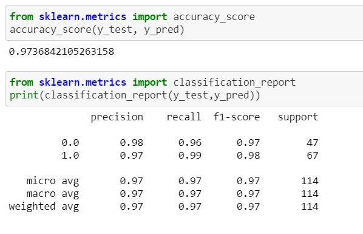

# Breast-cancer-classifier
1.Data from sklearn datasets

2.classification Problem and Data is balance

3.Used xgb classifier and SVC and catboost classifier algorithm

4.With catboost classifier algorithm get best performance accuracy around 97% and  recall  and F1 score around 0.97 precision 0.98

